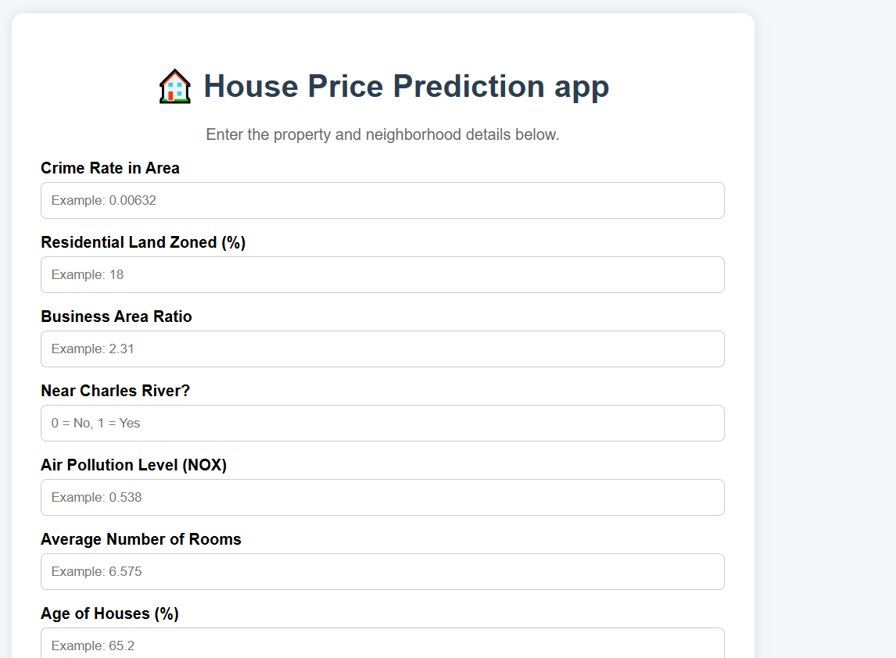
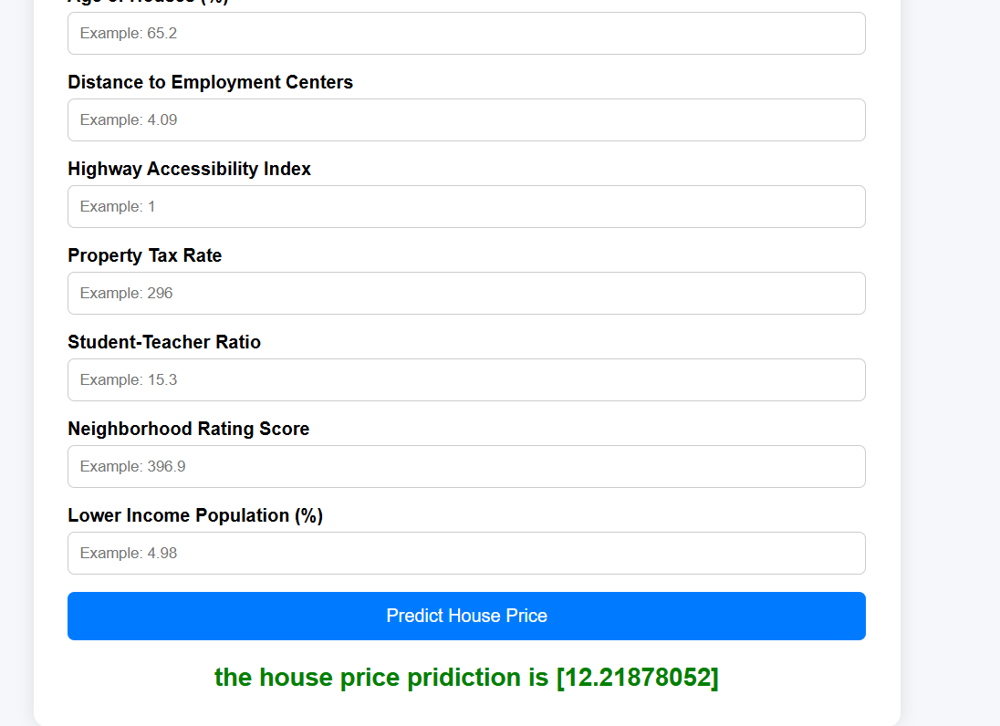
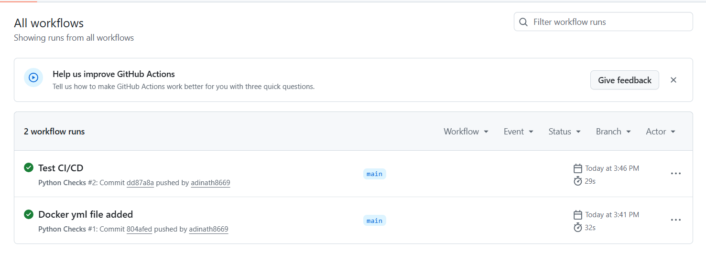
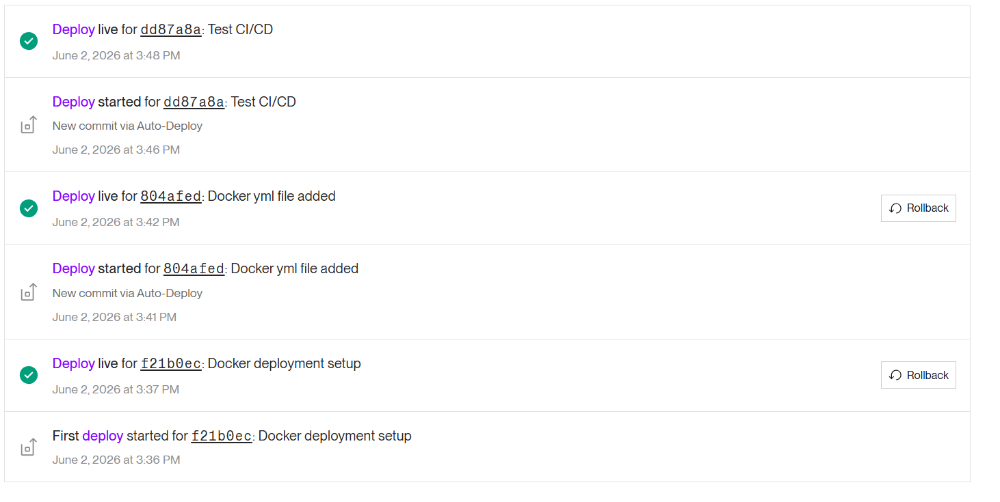

# 🏠 Boston Housing Price Prediction

A Machine Learning web application that predicts Boston house prices based on housing characteristics using a trained Linear Regression model.

## 🚀 Live Demo

https://bostonhousingpridiction.onrender.com

## 📌 Features

* House price prediction using Machine Learning
* Flask web application
* User-friendly frontend
* Data preprocessing with StandardScaler
* Docker containerization
* GitHub Actions CI pipeline
* Automatic deployment on Render

## 🛠️ Technology Stack

### Machine Learning

* Python
* NumPy
* Pandas
* Scikit-Learn

### Backend

* Flask

### Frontend

* HTML
* CSS

### DevOps

* Docker
* GitHub
* GitHub Actions
* Render

---

## 📂 Project Structure

```text
BostonHousingPridiction/
│
├── app.py
├── Dockerfile
├── requirements.txt
├── regmodel.pkl
├── scaling.pkl
├── BostonHousing.csv
│
├── templates/
│   └── home.html
│
├── .github/
│   └── workflows/
│       └── docker.yml
│
└── README.md
```

---

## ⚙️ Local Setup

### Clone Repository

```bash
git clone https://github.com/adinath8669/BostonHousingPridiction.git
cd BostonHousingPridiction
```

### Create Conda Environment

```bash
conda create -p venv python=3.11.5 -y
```

### Activate Environment

#### Windows

```bash
conda activate ./venv
```

### Install Dependencies

```bash
pip install -r requirements.txt
```

---

## ▶️ Run Application

```bash
python app.py
```

Open:

```text
http://127.0.0.1:5000
```

---

## 🐳 Docker Setup

Build Docker Image:

```bash
docker build -t boston-housing .
```

Run Container:

```bash
docker run -p 5000:5000 boston-housing
```

---

## 🔄 CI/CD Pipeline

This project uses GitHub Actions and Render for automated deployment.

Workflow:

```text
Developer
    │
    ▼
Git Push
    │
    ▼
GitHub Actions
    │
    ▼
Docker Validation
    │
    ▼
Render Auto Deploy
    │
    ▼
Production Application
```

---

## 📊 Machine Learning Model

### Algorithm

* Linear Regression

### Data Preprocessing

* StandardScaler

### Input Features

* Crime Rate
* Residential Land Zoned
* Business Area Ratio
* Charles River Proximity
* Nitric Oxide Concentration
* Average Number of Rooms
* Age of Houses
* Distance to Employment Centers
* Highway Accessibility
* Property Tax Rate
* Student-Teacher Ratio
* Neighborhood Score
* Lower Income Population Percentage

### Output

* Predicted House Price

---

## 📸 Screenshots

### Home Page



### Prediction Result



### GitHub Actions Workflow



### Render Deployment



---

## 👨‍💻 Author

**Adinath Kadam**

GitHub: https://github.com/adinath8669

---

## ⭐ If you found this project useful, consider giving it a star.
